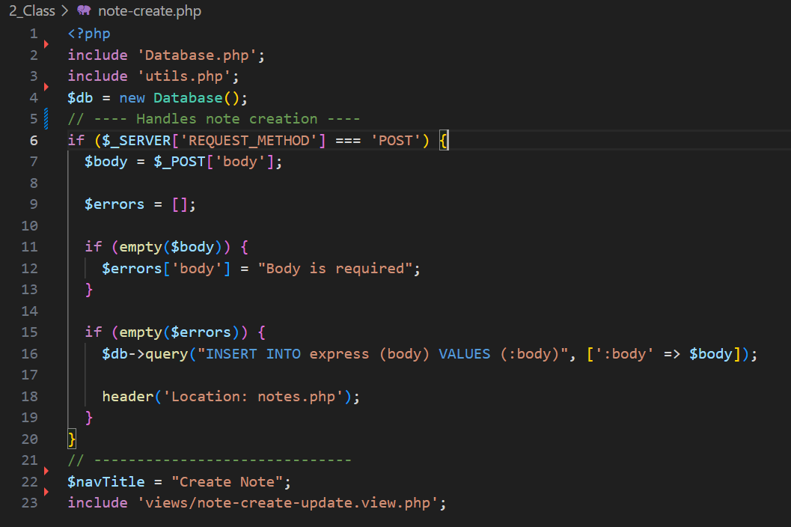

# PHP and MySQL Labs

## Lab 1: Laragon Setup and MySQL Basics

### Objective
The purpose of this lab is to set up Laragon, get hands-on experience with MySQL commands, and create your first database and table. 

### Steps
1. **Install and Configure Laragon**  
   Set up Laragon and ensure it is properly configured. Access MySQL through the Laragon terminal to get started.  

2. **Explore Basic MySQL Commands**  
   Learn essential MySQL commands, such as creating a database, selecting a database for use, and creating tables.  

3. **Insert Data into Tables**  
   Practice adding data to your table using the `INSERT` command.  

4. **Retrieve Data with Queries**  
   Use the `SELECT` command to query and view data. Practice retrieving all records from a table.  

5. **Understand Primary Keys and Timestamps**  
   Learn the importance of primary keys in uniquely identifying records and understand how timestamps are used in tables.

     
   *Fig: Laragon setup running on port 3307.*

---

## Note
For this lab, I used MySQL Workbench instead of phpMyAdmin. Since MySQL is already installed on my device, I find MySQL Workbench easier and more efficient to use.

     
   *Fig: Basic MySQL commands practiced during the lab.*

## Lab 2: MySQL Query Practice

### Objective
Enhance your ability to write effective SQL queries and solve real-world problems using MySQL.

### Steps
1. **Filter Data with Conditions**  
   Practice retrieving specific rows using the `WHERE` clause based on criteria such as ID, name, or date.  

2. **Sort and Group Data**  
   Explore the `ORDER BY` clause for sorting data and `GROUP BY` for grouping results.  

3. **Solve Query Challenges**  
   - Fetch records that match specific conditions (e.g., emails containing a certain domain name).  
   - Count the total rows in a table or calculate the average of a column.  

4. **Work with Aggregate Functions**  
   Practice using aggregate functions like `SUM`, `COUNT`, and `MAX` to manipulate and analyze data.  

5. **Document Queries and Results**  
   Keep a record of each query you run and the corresponding results to better understand how they work.

   
     
   *Fig: SQL query practice questions.*

---

## Lab 3: Introduction to MVC

### Objective
Gain an understanding of the Model-View-Controller (MVC) architecture and its role in web development.

### Steps
1. **Understand MVC Components**  
   - **Model**: Manages data and database interactions.  
   - **View**: Responsible for displaying information to users (HTML/CSS).  
   - **Controller**: Serves as a link between the Model and View, handling the application logic.  

2. **Set Up MVC Project Structure**  
   Create folders for `models`, `views`, and `controllers` to organize your code.

3. **Build a Simple Example**  
   - **Model**: Create a component to fetch mock data.  
   - **Controller**: Write logic to process the request and pass data to the view.  
   - **View**: Display the fetched data to the user.

     
   *Fig: Partials of the data.*

     
   *Fig: Example of mock data.*

---

## Lab 4: Connecting PHP to MySQL

### Objective
Learn how to connect a PHP application to a MySQL database using either MySQLi or PDO.

### Steps
1. **Understand MySQLi and PDO**  
   Compare MySQLi and PDO, and learn when to use each based on the project requirements.  

2. **Write Connection Code**  
   Develop a basic connection script that includes error handling for database connectivity.  

3. **Test Database Connectivity**  
   Create a simple PHP script to check if the database connection is successful.  

4. **Secure Credentials**  
   Learn techniques to securely store and manage database credentials.

     
   *Fig: Example of MySQLi and PDO connections.*

---

## Lab 5: Create Operation in PHP with MySQL

### Objective
Implement the Create functionality in PHP to insert data into the MySQL database.

### Steps
1. **Capture and Validate Form Data**  
   Use PHP to collect form inputs and validate the data (e.g., ensure no fields are left empty).  

2. **Test Data Insertion**  
   Test the form to ensure the data is correctly inserted into the database.

     
     
    
   *Fig: Example of Create operation.*

---

## Lab 6: Update and Delete Operations in PHP with MySQL

### Objective
Learn how to modify and remove records from the database using PHP.

### Steps
1. **Update Existing Records**  
   - Create a form to update records.  
   - Use a hidden input field to pass the unique identifier (e.g., ID) of the record.  
   - Validate the data before executing the update operation.

2. **Delete Records**  
   - Add a Delete button or link for removing records.  
   - Implement confirmation dialogs to prevent unintentional deletions.  

3. **Test Update and Delete Operations**  
   Verify the changes in the database to ensure the operations were successful.

     
    
   *Fig: Example of Update operation.*  

     
   *Fig: Example of Delete operation.*
